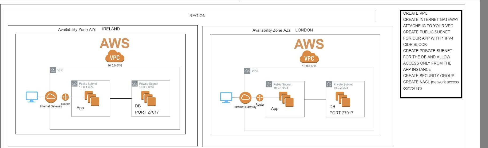

**Networking Concepts VPC -Subnet- Internet gateway- NACL - research -**

# AWS

# 2 Tier app deployment on AWS

# Ec2 instance for our nodeapp

# Ec2 instance for our DB

## AWS task

- Launch an ec2 instance with correct version of ubuntu
- ssh into the instance
- update
  `sudo apt-get update`
- upgrade `sudo apt-get upgrade`
- install nginx
  `sudo apt-get install nginx`
- check status
  `sudo systemctl status nginx`
- access nignx page with public IP
- share the IP in the chat

**second iteration**

- copy code from OS to AWS EC2 app with scp command
- install required dependencies for nodejs

**third iteration**

- create an ec2 instance for db
- install mongodb with required dependencies
- allow access only from the app instance
- connect the app with db to fetch the data
- app to work with reverse proxy without 3000 port, fibu, /- posts

**Networking and Security**

- Research what is a Security Group - VPC, public and private subnets, internet gateway, route tables, NACLs

Security group - firewall only on the instance level




#


### What is a VPC

- Virtual Private Cloud to define and control network
- VPC enables to launch AWS resources into a virtual network that we have. This virtual network closely resembles a traditional network that you'd operate in your data center
- Allows the EC2 instances to communicate with each other, we can also create multiple subnets within out VPC
- It benefits us with scalability of infrastructure of AWS

### Internet gateway

- Is the point which allows us to connect to internet
- A gateway that you attach to your VPC to enable communication between resources in your VPC and the internet

### What is a subnet

- Network inside the VPC
- A range of IP adresses in your VPC
- A subnet could have multiple EC2 instances

### Route Tables

- Set of rules, called routes
- Are used to determine where external network trafic is directed

### NACLS

- NACLS are an added layer of defence they work at the network level
- NACLS are stateless, you have to have rules to allow the request to come in and to allow the response to go back

### NACLS inbound Rules

- 100 allows inbound HTTP traffic from any IPv4 address.
- 110 allows inbound SSH trafic from your network over the internet
- 120 allows inbount return traffic from hosts on the internet that are responding to

### NACLS outbound Rules

- 100 to allow port 80
- 110 we need the CIRDR block and allow 27017 for outbound access to out Mongo DB serverin private subnet
- 120 to allow short lived ports between 1024 - 65535

### What is Security Group

- Work as a firewall on the instance level
- they are attached to the VPC and subnet
- they have inbound and outbound traffic rules defined
- S.G. are stateful, if you allowed inbound rule that will automatically be allowed outbound

### What are the Ephemeral ports/Dynamic ports

- short lived ports, automatically allocated based on the demand (ex. port 80)
- Allows outbound responses to clients on the internet
- port range 1024-65535


### Steps for app security Group

- Create a security group for the app
- allow port 80 to all
- allow port 22 for ssh

### Outbound rules

- Allow all

(for the private SG)

- Create a security group for the database
- Allow app security group (27017)

ssh -i ~/.ssh/DevOpsStudent.pem -o ProxyCommand="ssh -i ~/.ssh/DevOpsStudent.pem -W %h:%p ubuntu@54.171.233.174" ubuntu@10.0.2.121

create a new repo for Linux commands and share it

http://permissions-calculator.org/
link to check permissions

# Linux

- how to check Hidden Files and Directories
  `ls -a`
- The Manual, Flags
- `man cmd` - Manual of the command
- what is a wildecards and How to use Wildcards

Wildcards (also referred to as meta characters) are symbols or special characters that represent other characters. You can use them with any command such as ls command or rm command to list or remove files matching a given criteria, receptively.

- how can you do Process Management `top` and `ps`
- What is Currently Running on your system
- Killing a process/Crashed Process

There are various commands you can use to kill a process — kill, killall, pkill and top.

By default, For example, to kill a process named “firefox”, run:

`killall firefox`
To forcibly kill the process with SIGKILL, run:

`killall -9 firefox`
You can also use -SIGKILL instead of -9.

If you want to kill processes interactively, you can use -i like so:

`killall -i firefox`
If you want to kill a process running as a different user, you can use sudo:

`sudo killall firefox`
You can also kill a process that has been running for a certain period of time with the -o and -y flags. So, if you want to kill a process that has been running for more than 30 minutes, use:

`killall -o 30m <process-name>`

- `apt (install | remove)` - Package manager
- `mkdir` - Make folder
- `ls (-a)` - list files, -a shows all files
- `nano` - text editor
- `touch` - makefile
- `cd` .. - up a dir
- `pwd` - print working directory
- `mv` - move also used to rename
- `cp` - copy
- `rm` - remove
- `ll` - check permissions
- `chmod (+rwx | -rwx)` - change permissions
  - `+ | -` - add or remove permission
  - `r` - read permission
  - `w` - write permission
  - `x` - execute permission
  - `777` - read, write and execute for everyone
  - `400` - same as 777 but only for the issuing user
  - `600` - same as 777 but only for the file owner and restricts all others
- `top` - task manager
- `kill pid` - Kills a process based on its pid
- `sudo systemctl (status | start | stop | restart)` - Manage background services
- Wildcards:
  - `*` - All files
  - `.` - Current folder
  - `..` - Up one folder
- `head` - prints first 10 lines of a file
- `tail` - prints last 10 lines of a file
- `sort` - sorts information in a file
- `nl` - prints a file with numbered lines
- `wc` - print out a word count
- `cmd 1 | cmd 2` - Use command 1 and use that output as input for command 2
- `cmd > file` - redirect output into a file and overwrite the contents
- `cmd >> file` - redirect output into a file and append it to the end

# Bastion Server Lab - Jump Box

## Timings

45 - 60 Minutes

## Summary

Now that we've created a private subnet for our database instances we have a problem. We no longer have access to them via SSH.

To solve this we need to create a bastion server, also known as a jump box so that we can log in to the bastion and then from there access our database server to perform updates.

## Tasks

- What is a Bastion Server ( Jump Box)
- benefits and use case
- Create a new public subnet called bastion
- Create a new ubuntu instance called bastion in this subnet
- Create a security group that only allows access on port 22 from your IP
- Create a security group called bastion-access that only allows ssh access from the bastion group
- SSH to your bastion server and from there SSH to your database instance

A **bastion host/bastion server** is a special-purpose computer on a network specifically designed and configured to withstand attacks. The computer generally hosts a single application, for example a proxy server, and all other services are removed or limited to reduce the threat to the computer. It is hardened in this manner primarily due to its location and purpose, which is either on the outside of a firewall or inside of a demilitarized zone (DMZ) and usually involves access from untrusted networks or computers.

In an **Amazon Web Services (AWS)** context, a bastion host is defined as "a server whose purpose is to provide access to a private network from an external network, such as the Internet. Because of its exposure to potential attack, a bastion host must minimize the chances of penetration".

Another AWS-related definition is that bastion hosts are EC2 instances within a public subnet that is accessed via SSH (for Linux) and RDP (for Microsoft Windows). Once remote connectivity is established with the bastion host, "it then acts as a "jump" server, allowing you to use SSH or RDP" to log in to other EC2 instances within private subnets. It is important to configure them via security groups and network access control lists (NACLs) to act as a "bastion"; if so, it will act as "a bridge to your private instances via the internet".

### What is S3

- what is aws S3
- uses cases
- who is using S3
- set up s3, dependencies
- configure AWS CLI
- how can we get the authentication done to talk with S3
- we will apply crud
- S3: you will have a backup available to apply CRUD in the console of AWS

  **we need running EC2 to ssh into the instance and AWS access and secret**

- S3 is a Simple storage service provided by AWS
- It is used to store and retrieve any amount of data, at anytime, from around the world
- We can also host our static website on S3

- Create a bucket from AWSCLIT
- upload data
- download data
- delete data
- permissons of the bucket

- In order have AWSCLI we need to install the required dependencies
- Python
- pip
- Configure the AWSCLI with AWS keys to authenticate the access from our machine to S3

- `aws s3 sync s3://eng84shahrukhs3 README.md` to download the data from our S3 bucket

AWS CLI reference:

```
aws s3

aws s3 cp to copy data from your instance to S3 bucket

aws s3 mb make bucket

aws s3 mv move

aws s3 ls list files

aws s3 rb remove bucket

aws s3 rm remove file/data

aws s3 sync download data
```
