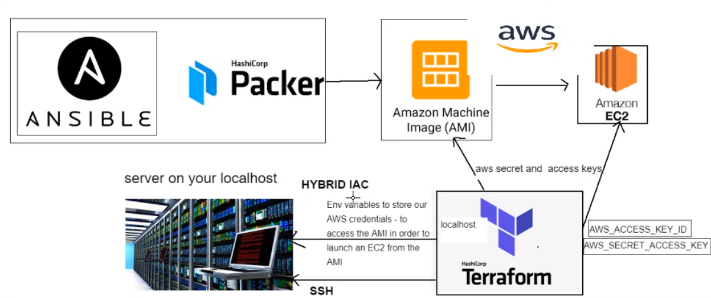
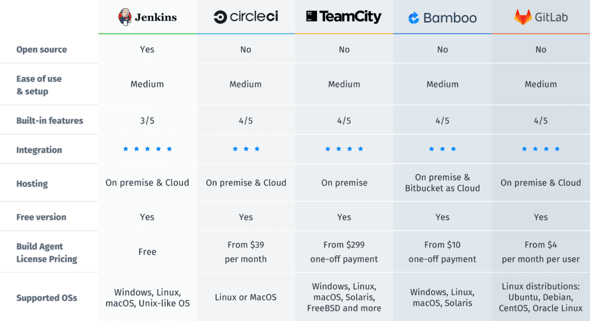
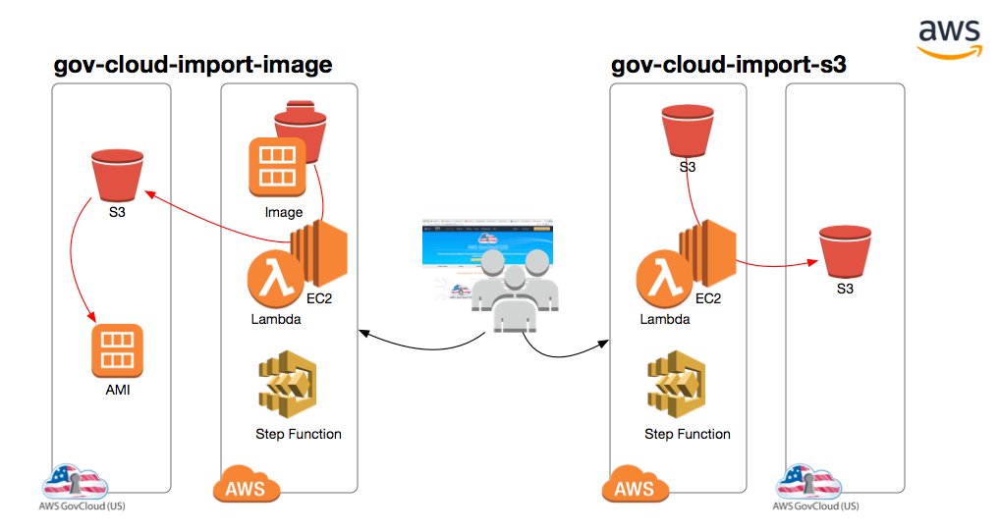
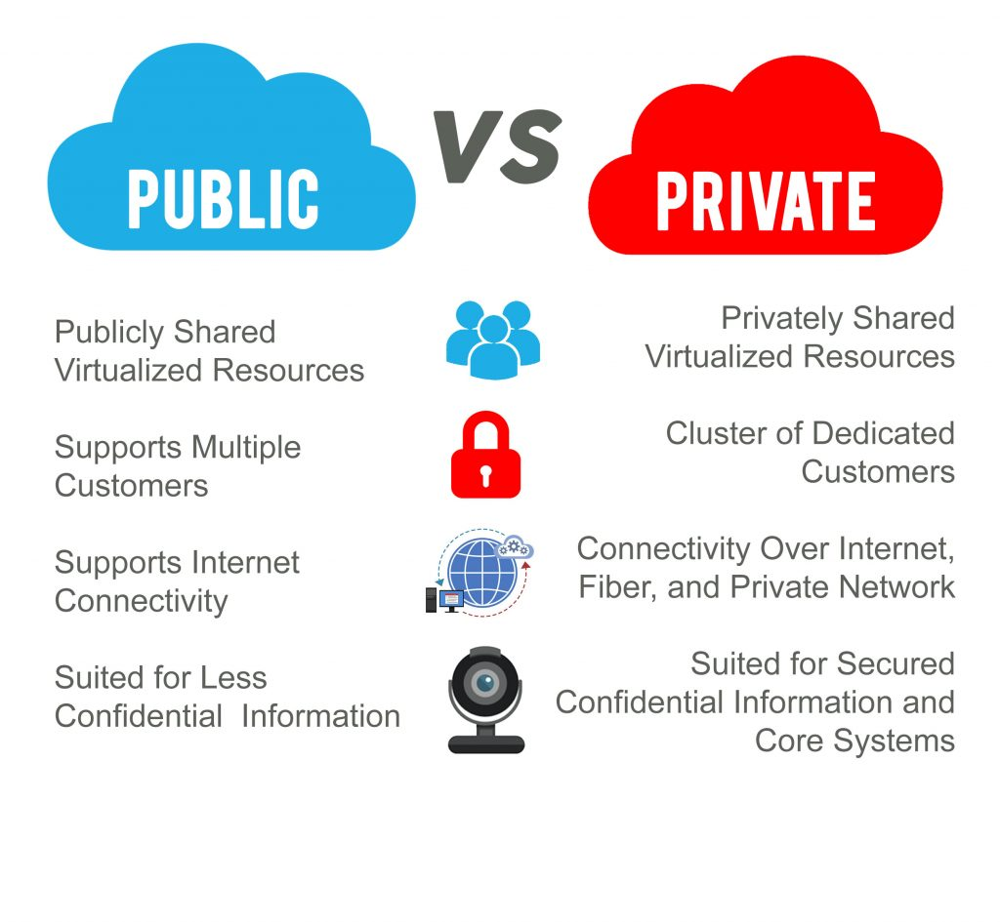
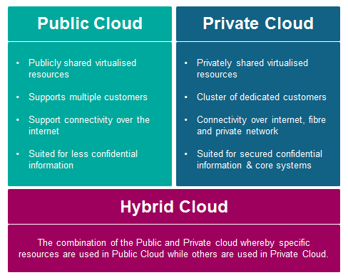
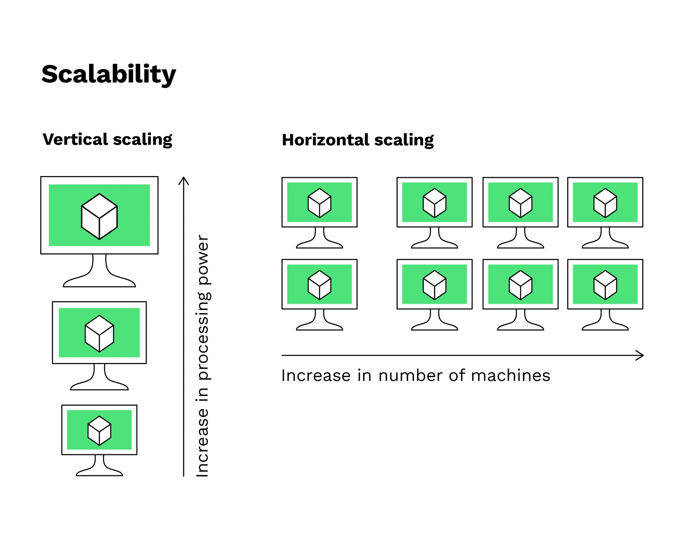
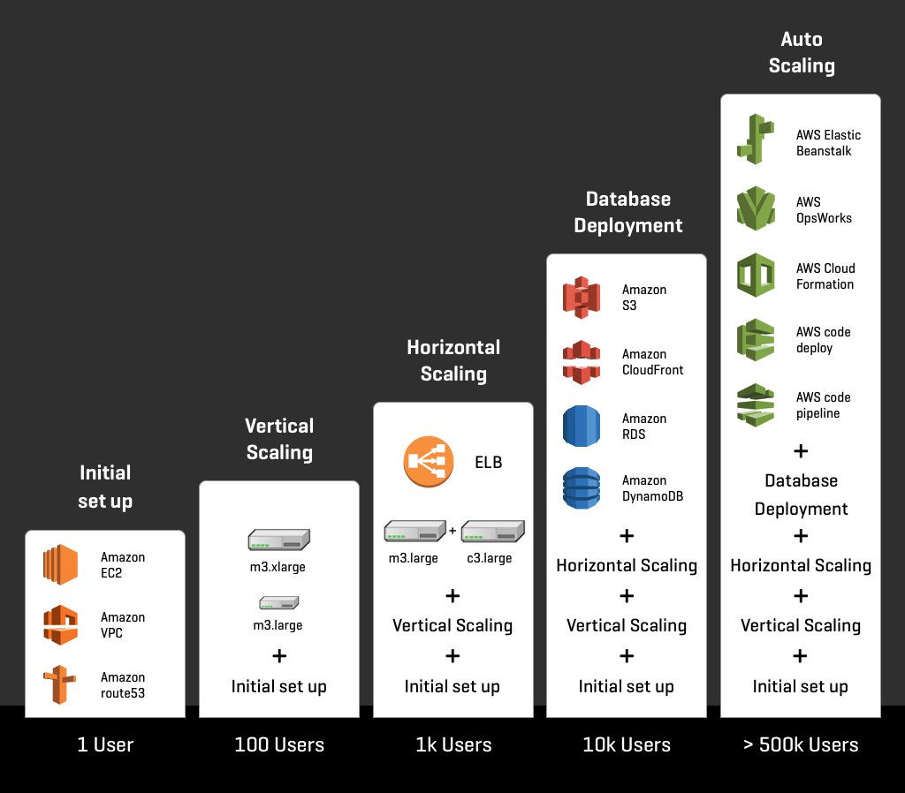

# Terrfarom and Benefits

Terraform is an open-source infrastructure as code software tool created by HashiCorp. Users define and provide data center infrastructure using a declarative configuration language known as HashiCorp Configuration Language, or optionally JSON.


db : ami-0824ad0deafb692a5

app : ami-08aaa3dea77ad1b51

## Terrafrom most used commands

### Terraform to launch ec2 with VPC, subents, SG services of AWS

### Terraform instalation and setting up the path in the env variable

- Setting Env variables for our AWS secret and access keys
- On windows `click on windows keys and type settings`

```
Windows
In Searc, search for and then select: System (Control Panel)
Click the Advanced system setting link
Click Enviroment Variables ...
In the Edit System Variable (or New System Variable) window, specify the value of the Path enviromant variable ...
```

- Name env variables as `AWS_ACCESS_KEY_ID` for secret key `AWS_SECRET_ACCESS_KEY`
- Lets create our Terraform env to access our AMI to launch EC2 instance

- `terraform init` initialize the terraform with required dependencies of the provider
- `terraform plan` check the syntax
- `terraform apply`
- `terraform destroy`

```
# Let's initialise terraform
# Providers?
# AWS

# This code will eventually launch an EC2 instance for us

# provider is a keyword in Terraform to define the name of cloud provider

# Syntax:

provider "aws" {
# define the region to launch the ec2 instance in Ireland
	region = "eu-west-1"
}

resource "aws_instance" "app_instance" {
  # var.name_of_resource loads the value from variable.tf into main.tf
  ami = var.webapp_ami_id

  #subnet_id = "aws_subnet.testing_subnet.id" # This line to be added after creation of subnet_id

  #vpc_security_group_ids = ["${aws_security_group.shahrukh_terraform_code_test.id}"]

  instance_type = "t2.micro"
  associate_public_ip_address = true
  tags = {
      Name = "${var.name}"
  }
  key_name = "ansible" # this key name needs to the as .pem file
  #aws_key_path = var.aws_key_path

}
resource "aws_vpc" "terraform_vpc_code_test" {
  cidr_block       = "10.0.0.0/16"
  instance_tenancy = "default"

  tags = {
    Name = "shahrukh_terraform_vpc_code_test"
  }
}

# Let's create a security group for our App instance

# Security group block of code:
resource "aws_security_group" "shahrukh_terraform_code_test_sg"  {
  name = "shahrukh_terraform_code_test"
  description = "app group"
  vpc_id = "vpc-07e47e9d90d2076da"

# Inbound rules for our app
# Inbound rules clode block:
  ingress {
    from_port       = "80" # for our to launch in the browser
    to_port         = "80" # for our to launch in the browser
    protocol        = "tcp"
    cidr_blocks     = ["0.0.0.0/0"] # allow all
  }
  # Inbound rules code block ends

  # Outbound rules clode block:

  egress {
    from_port       = 0
    to_port         = 0
    protocol        = "-1" # allow all
    cidr_blocks     = ["0.0.0.0/0"]
  }

  tags  = {
    Name = "var.name"
  }
}
# security group code block ends


#resource "aws_subnet" "testing_subnet" {

 # vpc_id = "vpc-07e47e9d90d2076da"
  #cidr_block = "enter the ip range that fits into your vpc range"
  #availability_zone = "eu-west-1a"
  #tags = {
  #  Name = "var.aws_subnet"
  #}
#}


# Launching an EC2 instance from our Node_app AMI
# resource is the keyword that allows us to add aws resource

# Resource block of code:

#resource "aws_instance" "app_instance"{
	# add the AMI id between "" as below
	#ami = "ami-042af9229265c27d0"
	#subnet_id = "${aws_subnet.app_subnet.id}"
	 # This line to be added after creation of subnet_id

	## Let's add the type of instance we would like launch
	#instance_type = "t2.micro"

        # Do we need to enable public IP for our app
  #  associate_public_ip_address = true
    # Tags is to give name to our instance
    ##tags = {
   #     Name = "eng84_shahrukh_terraform_node_app"
  #  }
#}#
#
# #Resource block of code ends here

#r#esource "aws_vpc" "Terraform_vpc_code_test"{
#	cidr_block = "10.0.0.0/16"
#	instance_tenancy = "default"
#
#	tags = {
#	  Name = "eng84_terraform_vpc"
#	}
#}
#
## Creating subnet
#resource "aws_subnet" "app_subnet" {
#
#	vpc_id = "vpc-07e47e9d90d2076da"
#	cidr_block = "10.0.1.0/24"
#	availability_zone = "eu-west-1a"
#
#	tags = {
#	   Name = "eng84_shahruh_app_subnet"

#	}
#}


# Resource block of code for VPC ends here


# terraform init
# terraform plan
# terraform apply
# terraform destroy
```

https://registry.terraform.io/providers/hashicorp/aws/latest/docs/resources/default_vpc

EXERCISE ( 15 Mins ) : Research how to create a subnet in the given VPC using its ID. Give it a tag name of yourname-app. Make sure it has a CIDR block that fits within the range of the DevOpsStudents CIDR block.

# IaC tools


# CI/CD tools



# AWS GovCloud

AWS GovCloud (US) gives government customers and their partners the flexibility to architect secure cloud solutions that comply with the FedRAMP High baseline; the DOJ’s Criminal Justice Information Systems (CJIS) Security Policy; U.S. International Traffic in Arms Regulations (ITAR); Export Administration Regulations (EAR); Department of Defense (DoD) Cloud Computing Security Requirements Guide (SRG) for Impact Levels 2, 4 and 5; FIPS 140-2; IRS-1075; and other compliance regimes.

In AWS US, they have data centres we can't buy.
Renting the services - pay as you go
Created gov cloud - for government sector only

Five years ago, companies wanted to migrate to the cloud
Secret services were not willing to integrate due to security

Issues:

- Premises goes on fire
- Stealing data (hard drives)
- Physical security only

AWS created Gov cloud to solve these issues



# Private cloud

Private clouds are cloud environments solely dedicated to the end user, usually within the user’s firewall. Although private clouds traditionally ran on-premise, organizations are now building private clouds on rented, vendor-owned data centers located off-premise.

All clouds become private clouds when the underlying IT infrastructure is dedicated to a single customer with completely isolated access.

## Private cloud benefits

Private clouds reduce instances of underused capacity. They allow the enterprise to automatically configure and reconfigure resources in any way it wants, since those resources aren’t restricted by their physical installations.

Private clouds provide additional benefits, such as:

Increased infrastructural capacity to handle large compute and storage demands
On-demand services using self-service user interfaces and policy-based management
Efficient resource allocation based on user needs
Increased visibility into resources across the infrastructure

# Public cloud

The public cloud is defined as computing services offered by third-party providers over the public Internet, making them available to anyone who wants to use or purchase them. They may be free of charge or sold on demand, allowing customers to only pay per usage for the CPU cycles, storage or bandwidth they consume.

## What are the pros and cons of using a public cloud?

### Pros:

Cost savings: Moving to a public cloud is a way for companies to cut down IT operations costs. Essentially, they are outsourcing these costs to a third party who can handle them more efficiently. Public clouds also typically cost less than private clouds, because the cloud provider is able to maximize their use of hardware and their profits by selling their services to multiple customers at once.
Less server management: If an organization uses a public cloud, internal teams don't have to spend time managing servers – as they do for legacy on-premises data centers or for internal private clouds.
Security: Many small and medium sized businesses may not have the resources to implement strong security measures. By using a public cloud service, they can outsource some aspects of cyber security to a larger provider with more resources.

### Cons:

Security and compliance concerns: Multitenancy might be a concern for businesses that need to meet strict regulatory compliance standards. Multitenancy also comes with a very small risk of data leakage, which may be more risk than some businesses in specialized fields are willing to tolerate. (In fact, the risk is miniscule; most cloud providers follow extremely high security standards.) Finally, it can be difficult to deploy the same security policies both for an organization's internal resources and for a public cloud that is somewhat outside of an organization's control (especially during a cloud migration).
Vendor lock-in: This is always a concern with cloud technology. An organization that uses the cloud will save money and become more flexible, but it can also end up reliant upon the cloud vendor's services – the virtual machines, storage, applications, and technologies they provide – in order to maintain their business operations.


# Hybrid cloud benefits

The benefits of a hybrid cloud strategy stem from the solution's ability to give IT leaders increased control over their data. Essentially, the hybrid model provides the business with multiple options so that stakeholders can pick an environment that best suits each individual use case.

Most businesses do not utilize the same level of computation power every day. In fact, an organization may find that its resource needs only balloon during one specific time of year. For instance, a health insurance application may need double the computing power during open enrollment. Rather than paying for those additional resources to sit idle for most of the year, an organization can save on costs by extending their private resources to a public cloud only when necessary.

A hybrid model requires much less space on-premises compared to a strictly private model. A business can deploy a private network on-site to handle internal needs, then automatically extend to the private cloud when computational resources exceed local availability. This model can benefit startups that can't afford to invest in a huge private data center as well as established enterprises



```
Tip for blockers during presentation:

If something goes wrong (bug etc.)

- Engage the audiance by asking them questions about their experiences
- Tell them a story to keep them engaged.
```

Exercise:
FOLLOW THE STEPS THAT WE DID BEFORE IN AWS:

1. CREATE THE VPC
2. CREATE AND ASSIGN THE SUBNET TO THE VPC
3. CREATE AN INSTANCE AND ASSIGN TO THE SUBNET



