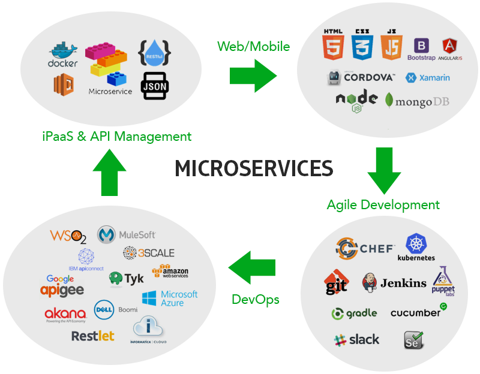
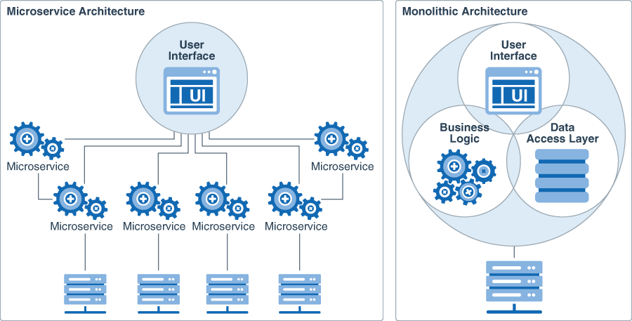
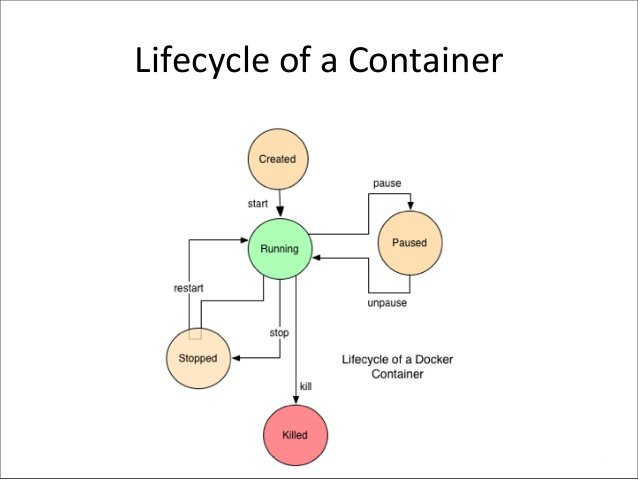
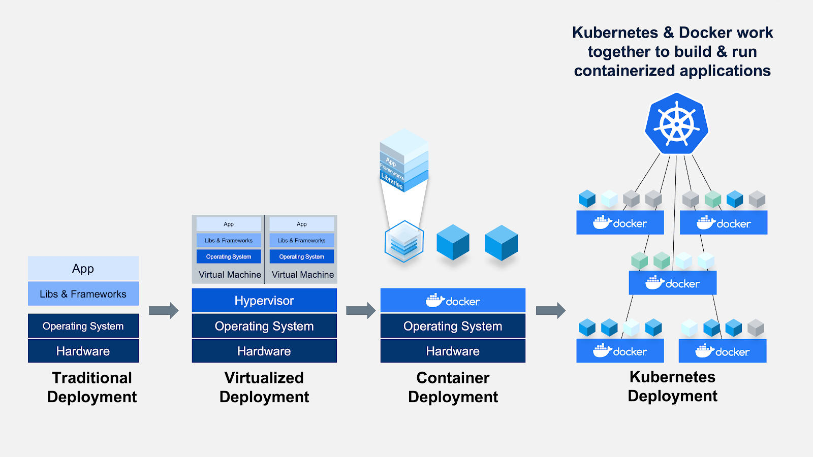

# Microservices_Docker_Kubernetes

**Containerization** is the process of packaging software code, its required dependencies, configurations, and other detail to be easily deployed in the same or another computing environment. In simpler terms, containerization is the encapsulation of an application and its required environment.

**Docker** is a set of platform as a service products that use OS-level virtualization to deliver software in packages called containers. Containers are isolated from one another and bundle their own software, libraries and configuration files; they can communicate with each other through well-defined channels.

### Difference between containerisation and VM

Linux® containers and virtual machines (VMs) are packaged computing environments that combine various IT components and isolate them from the rest of the system. Their main differences are in terms of scale and portability.

- Containers are typically measured by the megabyte. They don’t package anything bigger than an app and all the files necessary to run, and are often used to package single functions that perform specific tasks (known as a microservice). The lightweight nature of containers—and their shared operating system (OS)—makes them very easy to move across multiple environments.
- VMs are typically measured by the gigabyte. They usually contain their own OS, allowing them to perform multiple resource-intensive functions at once. The increased resources available to VMs allow them to abstract, split, duplicate, and emulate entire servers, OSs, desktops, databases, and networks.
  

### Microservices Diagram

### Monolithic vs Microservice

### VM vs Containers

#### Docker working diagram:

#### Docker installation and setup

- Installing docker on linux is simple:
- `sudo apt update && sudo apt upgrade -y`
- Install docker dependencies with `sudo apt install apt-transport-https ca-certificates curl software-properties-common`
- add the GPG key `curl -fsSL https://download.docker.com/linux/ubuntu/gpg | sudo apt-key add -`
- add the PPA `sudo add-apt-repository "deb [arch=amd64] https://download.docker.com/linux/ubuntu focal stable"`
- `sudo apt update`
- `sudo apt-get install docker-ce -y`
- Create an account on Docker-Hub
- run the command `docker login`
- insert your account credentials as required

#### Some commands:

- `docker --version`
- `docker run hello-world`
- `docker pull NAME-OF-IMAGE`
- `docker run NAME-OF-IMAGE` (it will download images from the public registry if not already present)
- run on ports `docker run -d -p 88:80 NAME-OF-IMAGE`
- delete image `docker rmi NAME-OF-IMAGE` or `docker rmi NAME-OF-IMAGE -f`
- checking running containers `docker ps`
- go into container `docker exec -it CONTAINER-ID`
- move/copy files between host and container `docker cp /source/file/path.txt CONTAINER:/dest/file/path/.txt`

#### Building customised images, microservices

- After editing an image, while still running:
- `docker commit !NAME!-OF-IMAGE OPTIONAL-TAGS` (it's recommended to tag the images with a dockerhub repo address, like `USERNAME/NAME-OF-REPO`)
- `docker push IMAGE`
  `alias docker="winpty docker"`

`docker exec -it df5de32f3f77 sh`

`docker cp index.html df5de32f3f77:/usr/share/nginx/html`

# Kubernetes

**Kubernetes** is an open-source container-orchestration system for automating computer application deployment, scaling, and management. It was originally designed by Google and is now maintained by the Cloud Native Computing Foundation.

## Features of Kubernetes:

- **Automates various manual processes:** for instance, Kubernetes will control for you which server will host the container, how it will be launched etc.
- **Interacts with several groups of containers:** Kubernetes is able to manage more cluster at the same time
- **Provides additional services:** as well as the management of containers, Kubernetes offers security, networking and storage services
- **Self-monitoring:** Kubernetes checks constantly the health of nodes and containers
- **Horizontal scaling:** Kubernetes allows you scaling resources not only vertically but also horizontally, easily and quickly
- **Storage orchestration:** Kubernetes mounts and add storage system of your choice to run apps
- **Automates rollouts and rollbacks:** if after a change to your application something goes wrong, Kubernetes will rollback for you
- **Container balancing:** Kubernetes always knows where to place containers, by calculating the “best location” for them
- **Run everywhere:** Kubernetes is an open source tool and gives you the freedom to take advantage of on-premises, hybrid, or public cloud infrastructure, letting you move workloads to anywhere you want

## Benefits of Kubernetes for companies:

- Control and automate deployments and updates
- Save money by optimizing infrastructural resources thanks to the more efficient use of hardware
- Orchestrate containers on multiple hosts
- Solve many common problems deriving by the proliferation of containers by organizing them in “pods” (see the last post!)
- Scale resources and applications in real time
- Test and autocorrection of applications

