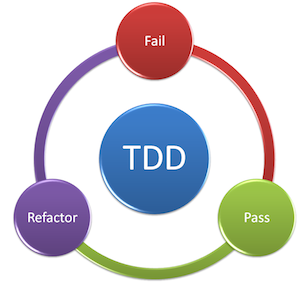

# TDD Test Driven Development

## Why should we use TDD

### what are the benefits of using TDD

**Best Use Cases**

- We will use Pytest unittest in Python to implement TDD
- TDD is widely used and is the cheapest way to test the code or implement test driven development

**Best practices for TDD**

- Write the smallest possible test case that matches what we need program
- TDD cycle start with everything failing - `RED`
- Write code to pass the test `GREEN`
- Refactor the code for next test `BLUE`
- This continues until all the test have successfully passed



There are also numerous assertions that are inherited from the TestCase base class, assertions are everything in testing...

| Method                    | Checks that          | New in |
| :------------------------ | :------------------- | :----- |
| assertEqual(a, b)         | a == b               |        |
| assertNotEqual(a, b)      | a != b               |        |
| assertTrue(x)             | bool(x) is True      |        |
| assertFalse(x)            | bool(x) is False     |        |
| assertIs(a, b)            | a is b               | 3.1    |
| assertIsNot(a, b)         | a is not b           | 3.1    |
| assertIsNone(x)           | x is None            | 3.1    |
| assertIsNotNone(x)        | x is not None        | 3.1    |
| assertIn(a, b)            | a in b               | 3.1    |
| assertNotIn(a, b)         | a not in b           | 3.1    |
| assertIsInstance(a, b)    | isinstance(a, b)     | 3.2    |
| assertNotIsInstance(a, b) | not isinstance(a, b) | 3.2    |

- Let's create file called `test_unittest_simplecalc.py`
- Naming convention is extremely important when it comes to TDD in Python

```python
# Lets create tests to check if the code would be running without any errors

from simple_calc import SimpleCalc
# importing the file and class where we would write our code
import unittest
# importing unittest to inherit TestCase to create out tests against the code


class CaclTest(unittest.TestCase):

    calc = SimpleCalc()  # create an object of our SimpleCalc() class

    def test_add(self):  # Naming convention - using test in the name of our function will let python interpretor know that this need to be tested
        # 2+2=4 outcome is True
        self.assertEqual(self.calc.add(2, 4), 6)
        # this test is checking if 2+4=6 that would be true, if true test will pass

    def test_substract(self):
        self.assertEqual(self.calc.substract(4, 2), 2)
        # This tests the values as 4-2=2 to be True if True the test passes

    def test_multiply(self):
        self.assertEqual(self.calc.multiply(3, 3), 9)
        # This tests the values as 3*3=9 to be True

    def test_divide(self):
        self.assertEqual(self.calc.divide(8, 4), 2)
        # This test the values as 8/4=2 if True

```

-Run the tests `python -m pytest`

**Lets write the code to pass the tests**

```python
class SimpleCalc:
    # pass
    def add(self, val1, val2):
        return val1 + val2
        # this function adds the values for val1 and val2 against the test we have in other class

    def substract(self, val1, val2):
        return val1 - val2
        # this f substracts 2 values

    def multiply(self, val1, val2):
        return val1 * val2
        # this f multiplys 2 values

    def divide(self, val1, val2):
        return val1 / val2
        # this f divide 2 values

```

- Running the test with  `python -m unittest discover -v`
```
python -m unittest discover -v
test_add (test_unittest_simplecalc.CalcTest) ... ok
test_divide (test_unittest_simplecalc.CalcTest) ... ok
test_multiply (test_unittest_simplecalc.CalcTest) ... ok
test_subtract (test_unittest_simplecalc.CalcTest) ... ok

----------------------------------------------------------------------
Ran 4 tests in 0.002s

OK
```
- `python -m pytest -v` a more comprehensive output
- Summary

- TDD helps reduce the unexpected errror


# TDD Bread Factory! :bread:

## Timings

30-45 Minutes

## Summary

TDD bread factory is the latest bread brand in Py Land. It always produces the best bread because it has the best testing strategy!

What they do is before they make any new bread, they make a test to make sure the end ouput is correct. Then they adjust the recipe until it's just right!

You are going to do the same with bread! This is called Test Driven Development.

## Tasks

This exercise is going to bring together lots of concepts.

### Learning Outcomes
Learning outcomes include:
- git
- github
- functions
- TDD
- Separation of concerns - this is important do not ignore!
- DRY code
- DOD


## Intalling and running
To run the naan factory do the following:

```python
import naan_factory
run_factory()
```


### TDD - test driven development

1. write the test
2. run it, and read the error
3. code and make it pass the test

this helps with:
- Stop over engineering
- Maintainable code
- Reduce technical debt
- Goes well with agile and working code
- errors can be your guide in complex systems

How it works is that we write unit tests.

##### Unit Tests

Test single pieces of code. Like a function.

**base of a test**
Usually has 3 phases.
- setup phase (know variables)
- calling of the function / piece of code with know variables
- asserting for expect output


### User stories for Naan Factory

```
#1
As a user, I can use the make dough with 'water' and 'flour' to make 'dough'.

#2
As a user, I can use the bake dough with dough to get naan.

#3
As a user, I can user the run factory with water and flour and get naan.

```

## Acceptance Criteria

* you have written tests
* test pass
* you have written more test to make sure everything works as indented
* all user stories are satisfied
* code does not break
* code has exit condition
* DOD if followed
