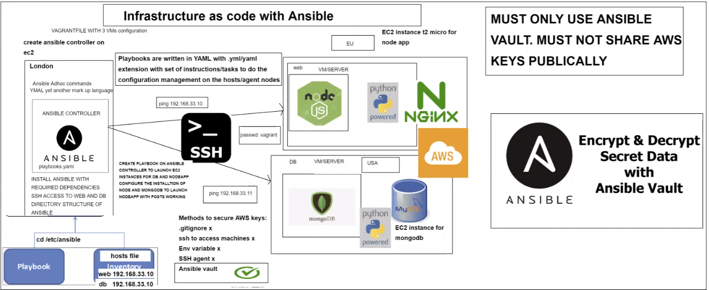

# Infrastructure as Code (IaC)

Infrastructure as Code(IaC) is a method to provision and manage IT infrastructure through the use of machine-readable definition files (i.e. source code), rather than through old fashioned operating procedures and manual processes.

IsC can help to achieve the goal.


# Infrastructure as Code - Benefits

- Speed and simplicity
- Configuration consistency
- Minimisation of risk
- Increased efficiency in software development
- Cost savings

# Infrastructure as Code - Best Practices

- Codify everything
- Document as little as possible
- Maintain version control
- Continously test, integrate and deploy
- Make your infrastructure code modular
- Make your infrastructure immutable (when possible)

# Two parts of IaC

## Configuration Management

Configuration Management tools are responsible for provisioning and maintaining the state of your systems. There are a lot of tools available to do this but some of the best known are:

- Chef
- Puppet
- Ansible

## Orchestration

Once we've created the templates for all the parts of the system we need orchestration tools and scripts that talks to the cloud to pull them together into the architecture.

- Cloud Formation (AWS)
- Ansible
- Terraform

# CTO choics on IT infrastructure

- On premises + Immutability
- Hardware waste + high labor cost
- On premises + Mutability - a lot of company running in this way
- Inefficient + high running cost + security concerns
- Cloud + Mutability
- Inefficient + not using cloud's advantage
- Cloud + Immutability - becoming popular
- Efficient + cost reduction + flexibility

# Ansible

Ansible is an open-source software provisioning, configuration management, and application-deployment tool enabling infrastructure as code. It runs on many Unix-like systems, and can configure both Unix-like systems as well as Microsoft Windows.


- `vagrant up`
- `vagrant suspend`
- `vagrant destroy`
- `ansible web -m ping`
- `sudo apt install tree` (in controller machine)
- `cd /etc/ansible/`
- `tree`

- add to hosts file
  `[web] 192.168.33.10 ansible_connection=ssh ansible_ssh_user=vagrant ansible_ssh_pass=vagrant`
- `ping 192.168.33.11`
- `ansible all -m ping`
- `ansible web -a "uname -a"`
- `ansible web -a "date"`
- `ansible web -a "free -m"`
- `ansible web -m shell -a "ls -a"`
- `sudo nano hosts`
- add to hosts file
  `[db] 192.168.33.11 ansible_connection=ssh ansible_ssh_user=vagrant ansible_ssh_pass=vagrant`
- `ansible db -m ping`
- `ansible web -a 'ls'` === `ansible web -m shell -a 'ls'`
- `ansible all -m shell -a "uptime"`
- https://docs.ansible.com/ansible/latest/user_guide/intro_adhoc.html

  _quick exercise to practice some more Ad-hoc commands before we move onto Ansible Playbooks_

- Time 5-10 minutes
- Find out the UPTIME of db server using Ansible Ad-hoc command.
- `ansible db -m shell -a "uptime"`
- Update and upgrade all packages using Ansible Ad-hoc command.
- `ansible db -a "sudo apt update -y`
- `ansible db -a "sudo apt upgrade -y"`
- TOP TIP- You can get help from above Ansible Doc link or any other source from internet if required.
  

# YAML - YAML Ain't Markup Language

YAML is a human-readable data-serialization language. It is commonly used for configuration files and in applications where data is being stored or transmitted. YAML targets many of the same communications applications as Extensible Markup Language but has a minimal syntax which

- in `/etc/ansible`
- `sudo nano install_nginx.yml`
- add following code

```
# This is an exmple of ansible playbook written in YAML
# YAML file starts with three --- dashes (---)
---

- hosts: web
# host is to define the name of your host machine or you could do all if you would like to run the same task in all the servers
# - hosts: web

  gather_facts: yes
# gathering facts before performing any tasks

  become: true
# become is used to get root permision to perform any tasks that require admin access

  tasks:
# tasks are executed in order, one at a time, against all server matched by the host
# every task should have a name, which is included in the output from running in the playbook
# the goal of each task is to execute a module, with very specific arguments

# In this task we would like to install Nginx on our web server
  - name: Installing Nginx
    apt: pkg=nginx state=present

    #notify:
    #- restart nginx
    #- name: Enable nginx during boot
      #service: name=nginx state=started enabled=yes
```

- `ansible-playbook install_nginx.yml`

- `sudo nano install_sql.yml`
- add following code

```

---
# Install SQL on DB machine
- hosts: db
# hosts will look for db in the hosts/invetory file

  become: true
#running in admin mode

  tasks:
#instruction/code/script to install sql
  - name: Installing in the DB server
    apt: pkg=mysql-server state=present
#the db will have the sql installed and available/enabled
```

- `ansible-playbook install_sql.yml`

# Setting up Ansible Vault

https://docs.ansible.com/ansible/2.9/user_guide/vault.html

- `sudo nano install_nodejs.yml`
- add following code

```

---
- hosts: web
  gather_facts: yes
  become: true

  tasks:
  - name: Installing nodejs in the web server
    apt: pkg=nodejs state=present

  - name: Installing NPM
    apt: pkg=npm state=present

```

- `ansible-playbook install_nodejs.yml`
- `sudo nano install_mongodb.yaml`

```
---
#Instaling Mongodb for our db to connect to web app so the /posts can work
- hosts: db
  gather_facts: yes
  become: true

  tasks:
  - name: Installing MongoDB into our DB serer 192.168.33.11
    apt: pkg=mongodb state=present
```

- `ansible-playbook install_mongodb.yaml`
- `sudo apt-add-repository --yes --update ppa:ansible/ansible`
- `sudo apt install python3-pip -y`
- `pip3 install boto boto3`

```
sudo mkdir group-vars
cd group-vars/
sudo mkdir all
ansible-vault create pass.yml
add this code with the right credential
aws_access_key: THISISMYACCESSKEY
aws_secret_key: THISISMYSECRETKEY
```

https://docs.ansible.com/ansible/latest/user_guide/guide_rolling_upgrade.html

https://docs.ansible.com/ansible/latest/user_guide/guide_rolling_upgrade.html

- ssh into web server
- go to `/etc/ssh/`
- in the `sshd_config` change `PermitRootLogin yes` and `PasswordAuthentication yes`
- restart ssh `sudo systemctl restart ssh`
- check status `sudo systemctl status ssh`

```
Next go to
cd etc/ssh
next open sshd_config file
sudo nano sshd_config

change below permissions
1. PermitRootLogin yes
change authentication to yes
2. PasswordAuthentication yes
save and exit the file
restart the ssh service
sudo systemctl restart ssh
```


