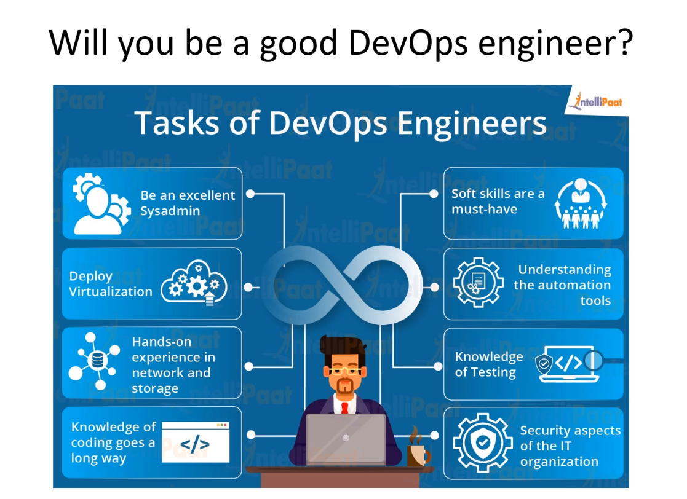
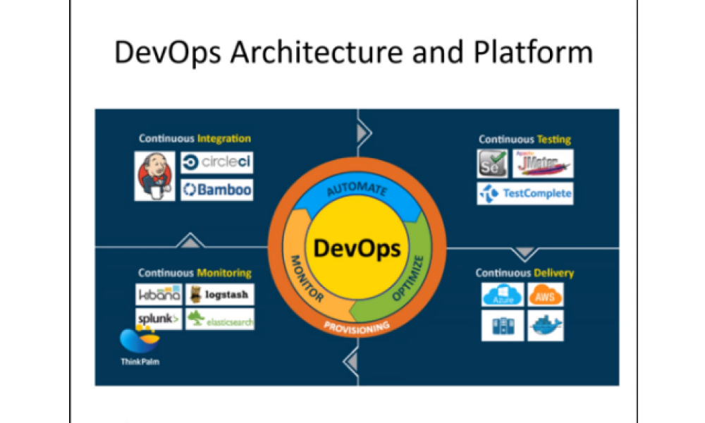
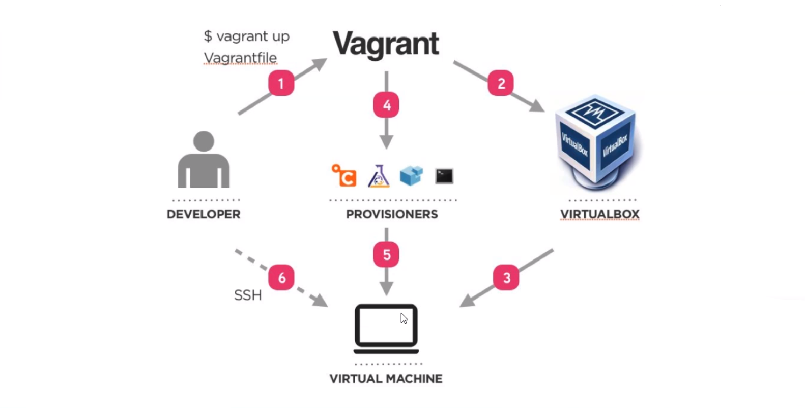

# DevOps_Introduction

## 4 Pillars

- Ease of use
- Flexibility
- Robustness
- Cost

## What is DevOps?

- A **collaboration** of Development and Operations
- A **culture** which promotes collaboration between Dev and Ops Team to deploy code to production faster in an automated & repeatable way
- A **practice** of development and operation engineers taking part together in the whole service lifecycle
- An **aproach** through which superior quality software can be deployed quickly and with more reliability
- An **alignment** of development and IT operations with better communication and colaboration



## DevOps Principles

1.  Customer-Centri Action
2.  End-To-End Responsability
3.  Continous Improvement
4.  Automate everything
5.  Work as one team
6.  Monitor and test everything

## Stages in DevOps Lifecycle

- Continous Development
- Continous Testing
- Continous Integration
- Continous Deployment
- Continous Monitoring

## DevOps Implementation

1.  Clud Platform

- AWS
- GCP
- Azure

2.  Infrastucture Architecture

- Virtualization
- Contanerization(Docker)

3.  DevOps Implementations

- Infrastructure as code(IaC)
- Infrastructure as a service(IaaS)
- Infrastructure as a platform(IaaP)
- Infrastructure as a product



## Vagrant Commands

- `vagrant init hashicorp/bionic64`
- `vagrant up` to spin up a virtual machine
- `vagrant destroy` to destroy
- `vagrant reload` to reload
- `vagrant status` to check how many machines are running and if they all running
- `vagrant ssh` to ssh into vritual machine (VM)
- `vagrant hault` to pause

- apt-get in Linux is a package manager to install/update packages

## Linux commands

- whoami `unam`
- list dir `ls` list all dir `ls -a`
- make Dir `mkdir`
- create file `nano file_name`
- `sudo` used to run commands as admin
- `sudo su` to go into admin mode
- `cd ..`
- `pwd`
- update command `sudo apt-get update -y`
- update command `sudo apt-get upgrade -y`
- `clear`
- renaming file `mv file-name new_file_name`
- copy file `cp path/file path/file`
- remove file `rm file_name`
- move file `mv path/file_name path`
- `chmod` change permision: 700 400 u x w r
- `top` to check current process
- `ll` check current permision of files
- `echo "something" > file` overwrites the file
- `echo "something" >> file` will append something to the file

```
  chmod +rwx filename
  means add permission
  r - read
  w - write
  x - execute
```

- would be to take that permission away\```
- `ps` check process `ps aux`
- install web server NGINX `sudo apt-get install nginx`
- check if nginx has been installed `systemctl status nginx`



### Lets run the tests on our hosts machine and pass the tests by installing the required dependencies

- first `sudo apt-get install ruby-bundler` to install the budler which help us to bundle all ruby dependecies/packages
- run `bundle` or `bundle install`
- `rake spec` to run the ruby tests

### Lets automate the instalation of required dependencies in our vagrant file to run our script

- add shell script path to our Vagrantfile
- `config.vm.provision "shell", path:"enviroment/provision.sh"

- Lets create aur script

```
#!/bin/bash

# run the update command
sudo apt-get update -y

# upgrade commnad
sudo apt-get upgrade -y

# install nginx
sudo apt-get install nginx -y

# install nodejs v6.0 with dependencies
sudo apt-get install python-software-properties

curl -sL https://deb.nodesource.com/setup_6.x | sudo -E bash -
sudo apt-get install nodejs -y

# install npm
sudo apt-get install npm

# install npm with pm2
sudo npm install -g pm2
```

# Multi Machine Vagrant

## Timings

120 - 180 Minutes

## Summary

The sample application has the ability to connect to a database. We need to provision our development environment with a vm for the database and one for the database.

Vagrant is capable of running two or more virtual machines at once with different configurations.

## Tasks

- Research how to create a multi machine vagrant environment
- Add a second virtual machine called "db" to your Vagrant file
- Configure the db machine with a different IP from the app
- Provision the db machine with a MongoDB database

## Notes

When you have the second machine running further configuration of the app is required to make it use the database. We will cover this in the next lesson.

You can test your database is working correctly by running the test suite in the test folder. There are two sets of tests. One for the app VM and one for the db VM. Make them all pass.

```
cd test
sudo apt-get install rake

sudo apt-get install ruby-bundler
# run bundle
# then rake spec
rake spec
```

## Acceptance Criteria

- Uses vagrant file
- Create 2 VM APP and Mongod
- Localhost set to development.local

- App works on Port 3000 (development.local:3000)

- Work with only command "vagrant up" &/or mininum commands
- All tests passing
- works on /posts
- works on /fibonacci/30

- Documentation exists as README.md file
- Documentation includes: Intro (purpose of repo), Pre Requisits and Intructions
- Instructions have a clear step by step

- repo exists on github

### Linux variables and Env var

- how can we check the existing env variable in our system `env` `printenv`
- `export env_name=env_value` example `export name=oleg`
- export is the keyword to create an env variable
- as key=value, key="some other value"
- key = value1:value2
- Whare are the system default env variables `USER`, `HOME`, `SHELL`, `PATH`, `TERM`
- `echo $PATH`
- to make is persistend put it in `.bashrc` or `.profile`
- `.profile` runs once when the pc is booting and `.bashrc` everytime when we reset `bash` so its best to put `env var` in `.bashrc`

- `sudo nano /etc/mongod.conf` to check the net config

- `sudo systemctl start mongod ` to start mongodb
- `sudo systemctl status mongod ` verify if its up and running
- `sudo systemctl stop mongod ` stop mongodb
- `sudo systemctl restart mongod` restart mongo

Here are some environment variables that an average user may encounter:

    PWD – Current working directory.
    HOME – The user’s home directory location.
    SHELL – Current shell (bash, zsh, etc.).
    LOGNAME – Name of the user.
    UID – User’s unique identifier.
    HOSTNAME – Device’s hostname on the network.
    MAIL – User’s mail directory.
    EDITOR – The Linux system default text editor.
    TEMP – Directory location for temporary files.

### Reverse Proxy with NGINX

- what is the default location of our nginx file that loads the nginx page
- `cd /etc/nginx/sites-available/`
- `nano /etc/nginx/sites-available/default/`
- we need to the default file in the same location to add our code to use it as our reverse proxy

- delete the `default` file
- add this

```
server {
listen 80;

 server_name _;

 location / {
proxy_pass http://localhost:3000;
proxy_http_version 1.1;
proxy_set_header Upgrade $http_upgrade;
proxy_set_header Connection 'upgrade';
proxy_set_header Host $host;
proxy_cache_bypass $http_upgrade;
}
}
```

# Nginx Reverse Proxy

## Timings

60 - 90 Minutes

## Summary

Our app is currently running on port 3000. This fine for development but browsers use port 80 by default to load web applications.

We could get the app to run on port 80 but that requires giving the app more privileges than we want to which is very dangerous.

We need to set up a reverse proxy.

## Tasks

Research how to install and configure Nginx as a reverse proxy. This will listen for requests on port 80 and pass them on to our app on port 3000.

## Notes

You will find many many tutorials on how to do this.

If you have started your app and you can see it running on dev.local ( without the :3000 ) you're configuration is correct.

You only need to edit one configuration file to do this.

Once you've completed this task, amend your provisioning script for your app VM so that it installs nginx and does the necessary configuration. Make sure you recreate your VM from scratch and run this provisioning script in order to test it works properly.
