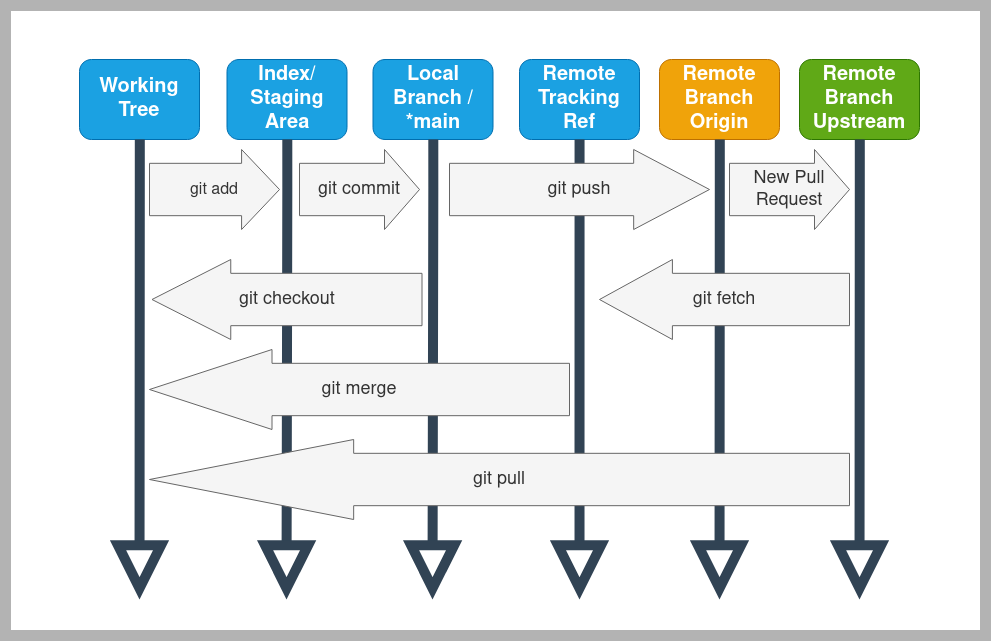

# Git_GitHub_connectivity

## Check for an existing SSH key

First, check if you've already generated SSH keys for your machine. Open a terminal and enter the following command:

```ls -al ~/.ssh```

If you've already generated SSH keys, you should see output similar to this:

```
-rw-------  1 user_name user_name  1766 Jul  7  2018 id_rsa
-rw-r--r--  1 user_name user_name   414 Jul  7  2018 id_rsa.pub
-rw-------  1 user_name user_name 12892 Feb  5 18:39 known_hosts
```

If your keys already exist, skip ahead to the **Copy your public SSH key** section below.

If you don't see any output or that directory doesn't exist (you get a `No such file or directory` message), then run:

```mkdir $HOME/.ssh```

Then generate a new set of keys with:

```ssh-keygen -t rsa -b 4096 -C your@email.com```

Now check that your keys exist with the `ls -al ~/.ssh` command and ensure that the output is similar to the one listed above.

**Note:** SSH keys are always generated as a pair of public (`id_rsa.pub`) and private (`id_rsa`) keys. It's extremely important that you **never reveal your private key**, and **only use your public key** for things like GitHub authentication.

## Add your SSH key to ssh-agent
ssh-agent is a program that starts when you log in and stores your private keys. For it to work properly, it needs to be running and have a copy of your private key.

First, make sure that ssh-agent is running with:
```eval "$(ssh-agent -s)" # for Mac and Linux```
or:
```eval `ssh-agent -s`
ssh-agent -s # for Windows```
Then, add your private key to `ssh-agent` with:
```ssh-add ~/.ssh/id_rsa```
## Copy your public SSH key
Next, you need to copy your public SSH key to the clipboard.

For Linux or Mac, print the contents of your public key to the console with:

```cat ~/.ssh/id_rsa.pub # Linux```
Then highlight and copy the output.

Or for Windows, simply run:

```clip < ~/.ssh/id_rsa.pub # Windows```
## Add your public SSH key to GitHub
Go to your GitHub settings page and click the "New SSH key" button:

Then give your key a recognizable title and paste in your public (`id_rsa.pub`) key:


Finally, test your authentication with:

```ssh -T git@github.com```
If you've followed all of these steps correctly, you should see this message:
```Hi your_user_name! You've successfully authenticated, but GitHub does not provide shell access.```


## Git

- What are the stages of git on local host
Every project under the distributed version control system Git, goes through three stages — Modified, Staged, and Committed.
- how can you reset/cancel if you have already run git add . command
To undo git add before a commit:

Run git reset <file> or git reset to unstage all changes.

In older versions of git, the commands were git reset HEAD <file> and git reset HEAD respectively. This was changed in Git 1.8.2

More information on How Git Reset Works
The git reset command allows you to RESET your current head to a specified state. You can reset the state of specific files as well as an entire branch.

Reset a file or set of files
The following command lets you selectively choose chunks of content and revert or unstage it.

git reset (--patch | -p) [tree-ish] [--] [paths]
Unstage a file
If you moved a file into the staging area with git add , but no longer want it to be part of a commit, you can use git reset to unstage that file:

git reset HEAD FILE-TO-UNSTAGE
The changes you made will still be in the file, this command just removes that file from your staging area.

Reset a branch to a prior commit
The following command resets your current branch’s HEAD to the given COMMIT and updates the index. It basically rewinds the state of your branch, then all commits you make going forward write over anything that came after the reset point. If you omit the MODE , it defaults to --mixed :

git reset MODE COMMIT
The options for MODE are:

--soft : does not reset the index file or working tree, but resets HEAD to commit . Changes all files to “Changes to be commited”
--mixed : resets the index but not the working tree and reports what has not been updated
--hard : resets the index and working tree. Any changes to tracked files in the working tree since commit are discarded
--merge : resets the index and updates the files in the working tree that are different between commit and HEAD, but keeps those which are different between the index and working tree
--keep : resets index entries and updates files in the working tree that are different between commit and HEAD. If a file that is different between commit and HEAD has local changes, the reset is aborted
Points to Note
Be very careful when using the --hard option with git reset since it resets your commit, staging area and your working directory. If this option is not used properly then one can end up losing the code that is written.
- what is a git staging area
The staging area is like a rough draft space, it's where you can git add the version of a file or multiple files that you want to save in your next commit (in other words in the next version of your project).
- workflow and the stages

- git merge and merge conflicts
Git can handle most merges on its own with automatic merging features. A conflict arises when two separate branches have made edits to the same line in a file, or when a file has been deleted in one branch but edited in the other. Conflicts will most likely happen when working in a team environment.
- best practice to resolve git merge conflicts
Git gives a clue to resolving conflicts in its error message. It says Merge conflict in [filename1], so you know there is a problem with that file. Then it says fix conflicts and then commit the result, so if you follow directions, edit the file, then commit it, everything should work fine.
