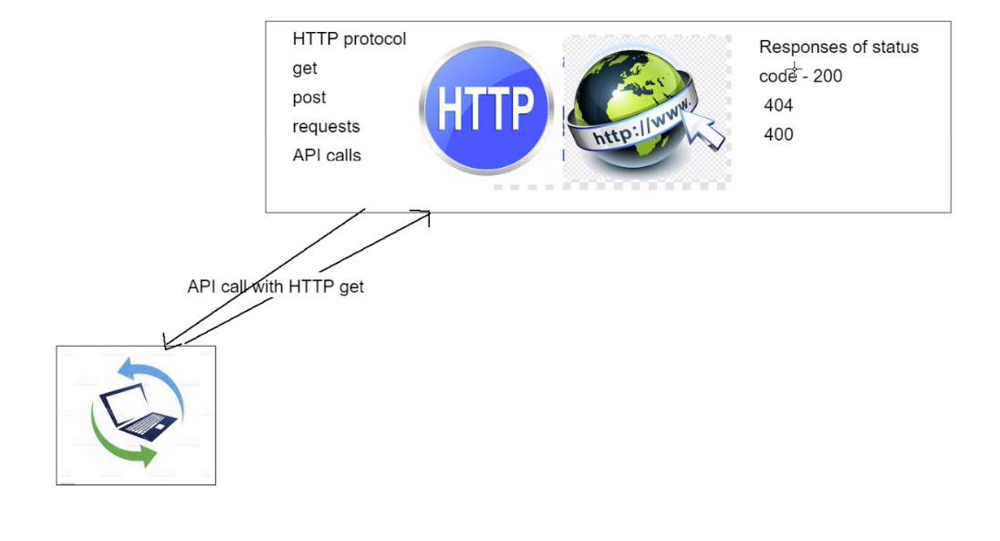

# Python_SQL

## Enstablishing a connection with PYODBC

### Apply CRUD

### Making data persistent

```python
# To establish connection between Python and SQL we will use PYODBC
import pyodbc

server = "18.135.103.95"
database = "Northwind"
username = "SA"
password = "Passw0rd2018"
docker_Northwind = pyodbc.connect(
    'DRIVER={ODBC Driver 17 for SQL Server};SERVER='+server+';DATABASE='+database+';UID='+username+';PWD=' + password)

# Lets check if the connection has been validated and cursor object is created
cursor = docker_Northwind.cursor()
print(cursor.execute("SELECT @@version;"))

# Lets fetch some data from the Northwind DB
row = cursor.fetchone()
print(row)

# Lets connect to our DB and fetch some data from Customers table
customers_rows = cursor.execute("SELECT * FROM Customers").fetchall()
print(customers_rows)
# We use execute to run our queries within a string
# fetchall() gets all the data from the table

products_rows = cursor.execute("SELECT * FROM Products").fetchall()
# Lets iterate through the product Table and check the UnitPrice available
for records in products_rows:
    print(records.UnitPrice)

row = cursor.execute('SELECT * FROM Products')
while True:
    record = row.fetchone()
    if record is None:
        break
    print(record.UnitPrice)

# to close connection northwind_database.close()
```
 - In case it doesnt work check if the pyodbc and ODBC driver is installed correctly
# SQL task

# SQL OOP

## Timings

25 - 30

- OOP example using pyodbc

create an example of how we can create service objects related to a particular table.

## An sql manager for the products table

create an object that relates only to the products table in the Northwind database. The reason for creating a single object for any table within the database would be to ensure that all functionality we build into this relates to what could be defined as a 'business function'.

As an example the products table, although relating to the rest of the company, will service a particular area of the business in this scenario we will simply call them the 'stock' department.

The stock department may have numerous requirements and it makes sense to contain all the requirements a code actions within a single object.

Create two files `nw_products.py` & `nw_runner.py` and then we will move into creating our object.

APPLY OOP - DRY CRUD WHERE POSSIBLE


