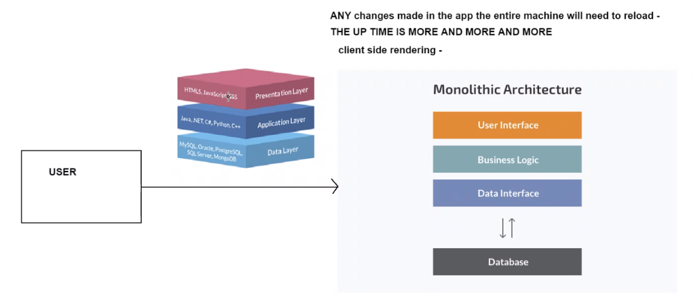

**Networking Concepts VPC -Subnet- Internet gateway- NACL - research -**

# AWS

# 2 Tier app deployment on AWS

# Ec2 instance for our nodeapp

# Ec2 instance for our DB

## AWS task

- Launch an ec2 instance with correct version of ubuntu
- ssh into the instance
- update
  `sudo apt-get update`
- upgrade `sudo apt-get upgrade`
- install nginx
  `sudo apt-get install nginx`
- check status
  `sudo systemctl status nginx`
- access nignx page with public IP
- share the IP in the chat

**second iteration**

- copy code from OS to AWS EC2 app with scp command
- install required dependencies for nodejs

**third iteration**

- create an ec2 instance for db
- install mongodb with required dependencies
- allow access only from the app instance
- connect the app with db to fetch the data
- app to work with reverse proxy without 3000 port, fibu, /- posts

**Networking and Security**

- Research what is a Security Group - VPC, public and private subnets, internet gateway, route tables, NACLs

Security group - firewall only on the instance level

#

