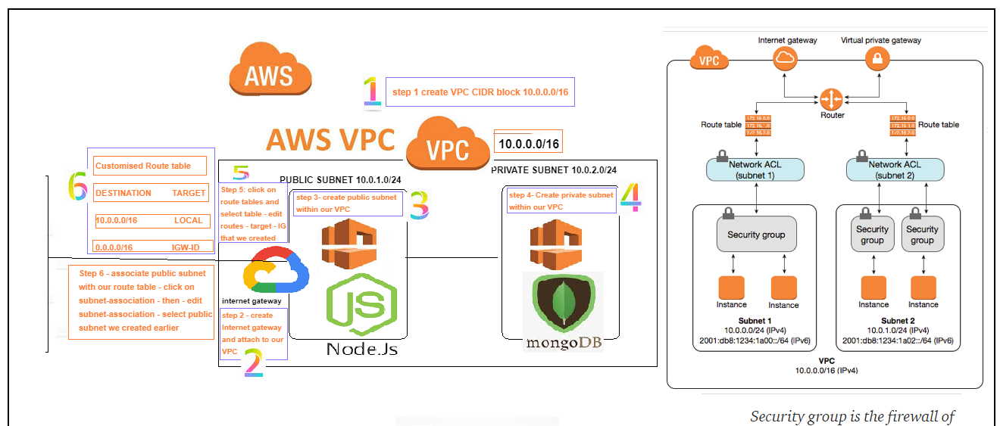
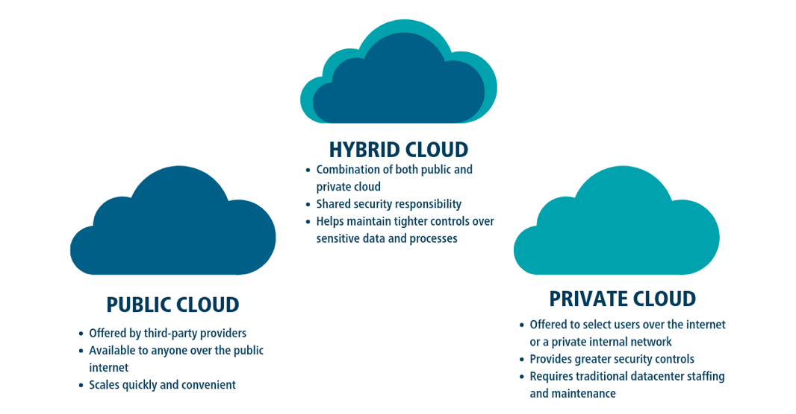

**Networking Concepts VPC -Subnet- Internet gateway- NACL - research -**

# AWS

# 2 Tier app deployment on AWS

# Ec2 instance for our nodeapp

# Ec2 instance for our DB

## AWS task

- Launch an ec2 instance with correct version of ubuntu
- ssh into the instance
- update
  `sudo apt-get update`
- upgrade `sudo apt-get upgrade`
- install nginx
  `sudo apt-get install nginx`
- check status
  `sudo systemctl status nginx`
- access nignx page with public IP
- share the IP in the chat

**second iteration**

- copy code from OS to AWS EC2 app with scp command
- install required dependencies for nodejs

**third iteration**

- create an ec2 instance for db
- install mongodb with required dependencies
- allow access only from the app instance
- connect the app with db to fetch the data
- app to work with reverse proxy without 3000 port, fibu, /- posts

**Networking and Security**

- Research what is a Security Group - VPC, public and private subnets, internet gateway, route tables, NACLs

Security group - firewall only on the instance level

#

### What is a VPC

- Virtual Private Cloud to define and control network
- VPC enables to launch AWS resources into a virtual network that we have. This virtual network closely resembles a traditional network that you'd operate in your data center
- Allows the EC2 instances to communicate with each other, we can also create multiple subnets within out VPC
- It benefits us with scalability of infrastructure of AWS

### Internet gateway

- Is the point which allows us to connect to internet
- A gateway that you attach to your VPC to enable communication between resources in your VPC and the internet

### What is a subnet

- Network inside the VPC
- A range of IP adresses in your VPC
- A subnet could have multiple EC2 instances

### Route Tables

- Set of rules, called routes
- Are used to determine where external network trafic is directed

### NACLS

- NACLS are an added layer of defence they work at the network level
- NACLS are stateless, you have to have rules to allow the request to come in and to allow the response to go back

### What is Security Group

- Work as a firewall on the instance level
- they are attached to the VPC and subnet
- they have inbound and outbound traffic rules defined
- S.G. are stateful, if you allowed inbound rule that will automatically be allowed outbound

### What are the Ephemeral ports/Dynamic ports

- short lived ports, automatically allocated based on the demand (ex. port 80)
- Allows outbound responses to clients on the internet
- port range 1024-65535

