## AWS VPC configuration with Subnets

### Step 1: Create the VPC

1. Click `Your VPCs`, then `Create VPC`
   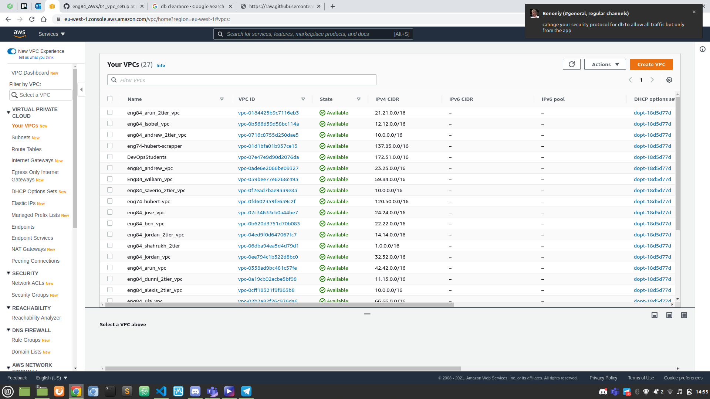
2. Change the VPC name-tag to `Eng84_oleg_2tier_vpc`
3. Change IPv4 CIDR block to `0.0.0.0/16` where the first 2 numbers are unique e.g. `10.0.0.0/16`
   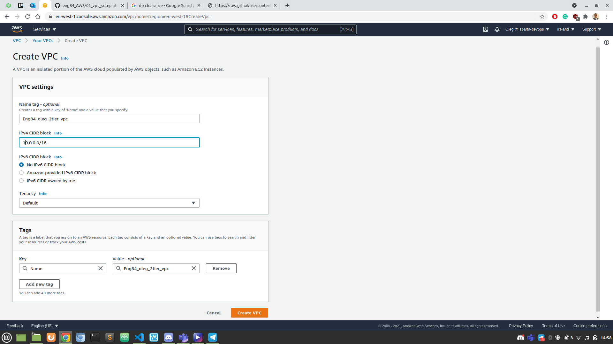
4. Click `Create VPC`

### Step 2: Create the Internet Gateway and Attach to VPC

This needs to be done, so that your VPC can connect to the internet.

1. Click `Internet Gateways`, then `Create internet gateway`
   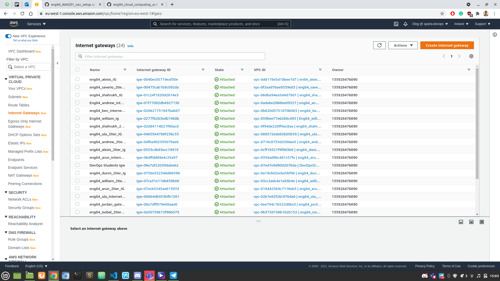
2. Change the nametag to `Eng84_oleg_2tier_IG`
3. Click `Create Internet Gatway`
   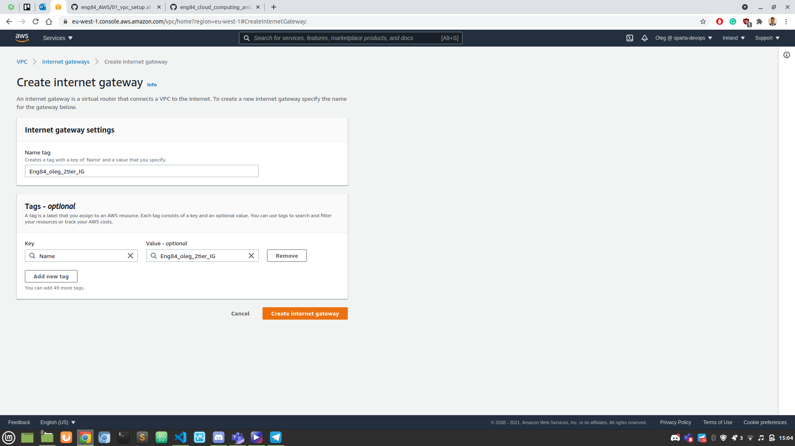
4. Click `Actions`, then `Attach to VPC`
   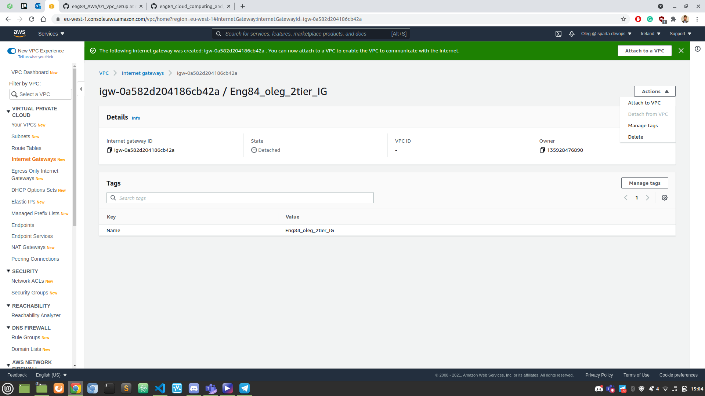
   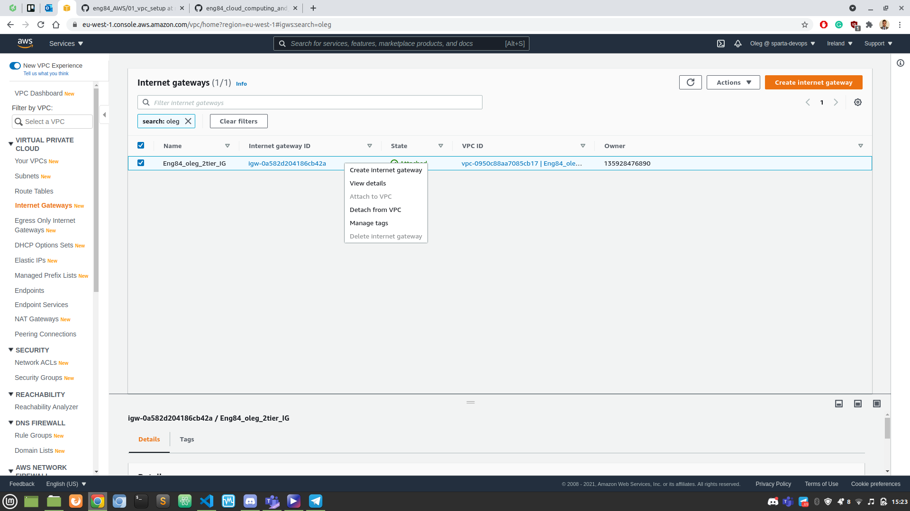
5. Select the VPC you created, then click `Attach internet gateway`
   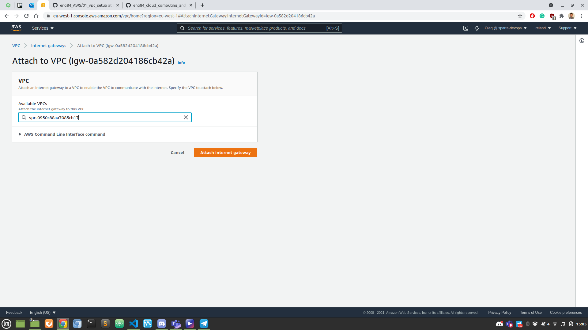

### Step 3: Create the Subnets

1. Click `Subnets`, then `Create subnet`
   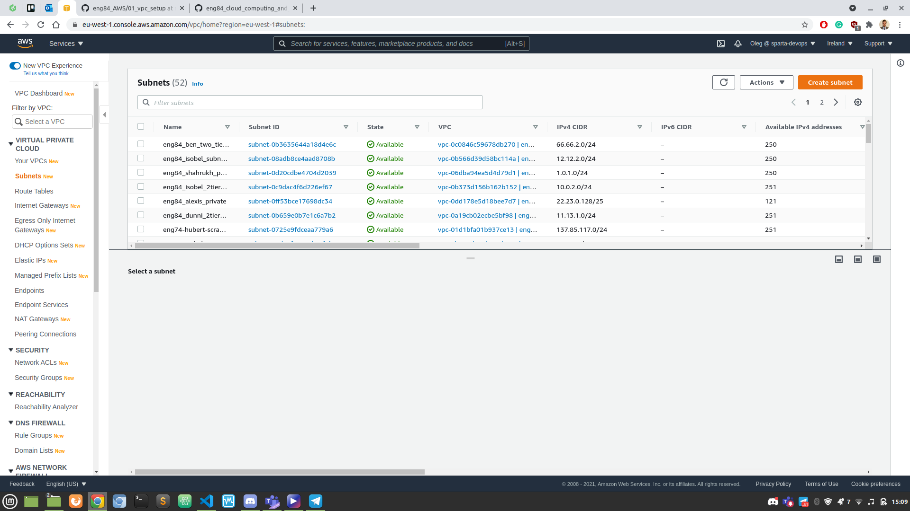
2. Select your VPC
3. Add the Subnet name as `Eng84_oleg_public_app_subnet`
4. Availability zone to `1c`, but `No preference` is fine
5. IPv4 CIDR block to `10.0.1.0/24` as per the VPC IP
6. Click `Create Subnet`
   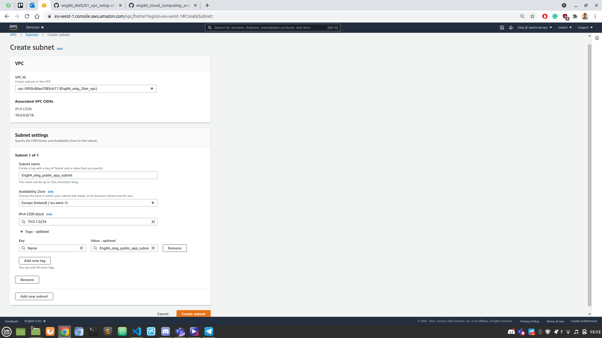
7. Repeat the above steps for the Private Subnet, but with the applicable name and the third number of the IPv4 CIDR block must be unique.
   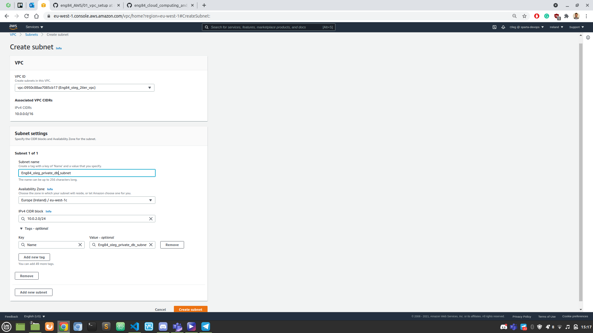

### Step 4: Setting up Routing Tables

First, we will find our route table and link the public subnet into it.

1. Go on `Routing Tables`
2. Click on the unnamed route tables until you find the one with your VPC or type your name in the search bar
3. Rename it to `Eng84_oleg_public_app_rt`
   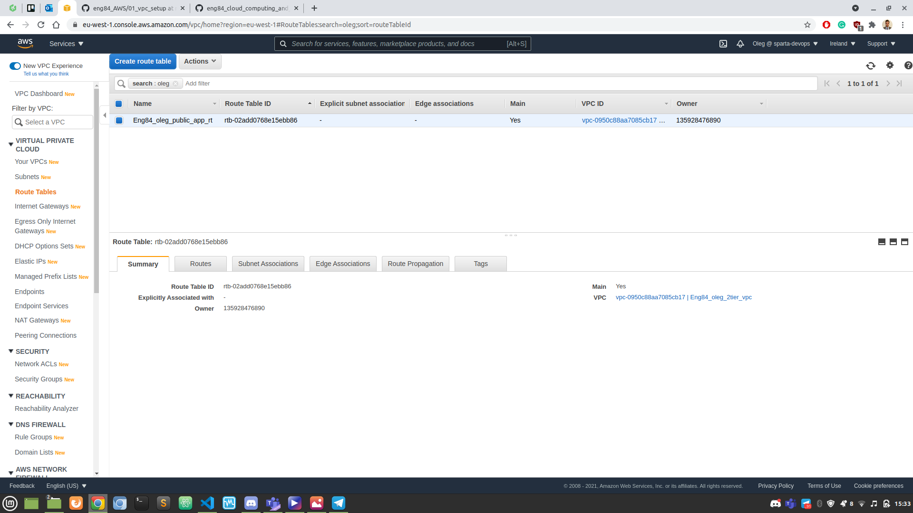
4. With the route table selected, select the `Routes` tab
5. Click `Edit routes` and do the following:
   - Set the destination to `0.0.0.0/0`
   - Set the target to `Internet Gateway`, then select your internet gateway
   - Save the configurations
     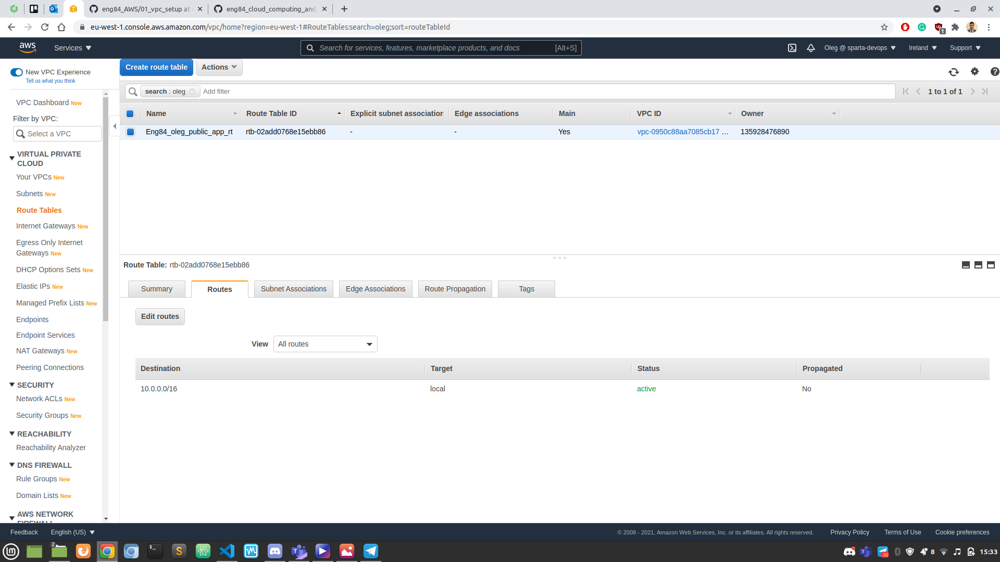
6. Select the `Subnet Associations` tab to link the Public Subnet
   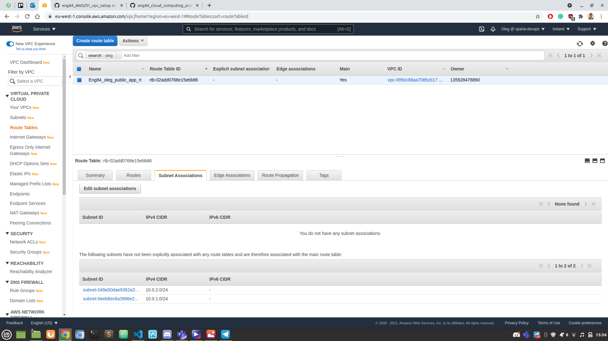
7. Click `Edit subnet associations` and do the following:
   - Select the public subnet you have created
   - Click `Save`
     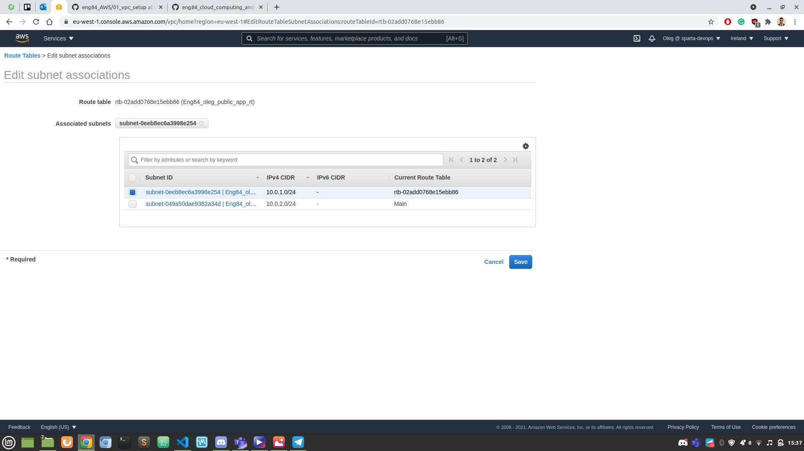

Next, we'll create a separate route table for the private subnet.

1. Click `Create route table`, then do the following:
   - Set the Name tag to `Eng84_oleg_private_db_rt`
   - Select your VPC
   - Click `Create`
   - NOTE: This route table is not connected to the internet.
2. With the new route table selected, select the `Subnet Associations` tab
3. Click `Edit subnet associations` and do the following:
   - Select the PRIVATE subnet you have created
   - Click `Save`

Both route tables are now set up!

### Step 5: Creating the EC2 instances

First, we'll create the instance for the app.

1. Click `Launch Instance`
2. Choose `Ubuntu Server 16.04 LTS (HVM), SSD Volume Type` as the Amazon Machine Image (AMI)
3. Choose `t2.micro` as the instance type (the default)
4. On Configure Instance Details:
   - Change the VPC to your VPC
   - Change subnet to your public subnet
   - Enable `Auto-assign Public IP` for the app
5. Skip `Add Storage` (keep defaults)
6. Add a tag with the `Key` as `Name` and the value as shown below:
   - `Eng84_name_appType`
   - `Eng84_oleg_db`, `Eng84_oleg_app`, etc.
7. Security group name should be `Eng84_oleg_app_sg` for the app
   - For the SSH rule:
     - Set to Port 22
     - Source: My IP
     - Description: My IP
   - Add another rule for HTTP:
     - Set to Port 80
     - Custom Source: `0.0.0.0/0, ::/0` (default)
8. Review and Launch
9. Select the existing DevOpsStudent key:pair option for SSH

Now, we'll create an instance for the database.

1. Repeat steps 1 to 3 from the above
2. Repeat step 4, but change the subnet to your private one instead.
3. Repeat steps 5 and 6. Adjust the name applicable for step 6.
4. Repeat step 7, but replace the HTTP rule for All traffic:
   - Custom Source: `10.0.1.0/24` (IPv4 for Public Subnet)
   - This only allows the app to access the database
5. Repeat steps 8 and 9 as normal

### Step 6: Connecting the EC2 instances

Let's start with the app and import the files.

1. Go to the directory before the app folder.
2. Execute this command: `scp -i ~/.ssh/DevOpsStudent.pem -r app/ ubuntu@app_ec2_public_ip:~/app/`
3. Change to the `~/.ssh`
4. Click `Connect`, then run the SSH command given from the `SSH client` instructions
5. If you are asked for a finger print, type yes.
6. Create the provisions file and copy, paste the contents. Adjust the directories as needed (hint: use `pwd`).
7. Run the provision file using `./privision_file_name.sh`. Change permissions with `chmod` if needed.
8. Run the environment variable command, so the app can connect to the database: `echo "export DB_HOST=mongodb://db_private_ip:27017/posts" >> ~/.bashrc`
9. Do the following if you want to apply the reverse proxy manually:

   - Execute: `sudo nano /etc/nginx/sites-available/default`
   - Replace it all with the code below:

     ```
     server {
         listen 80;

         server_name _;

         location / {
             proxy_pass http://localhost:3000;
             proxy_http_version 1.1;
             proxy_set_header Upgrade $http_upgrade;
             proxy_set_header Connection 'upgrade';
             proxy_set_header Host $host;
             proxy_cache_bypass $http_upgrade;
         }
     }
     ```

Next, we'll connect to the database instance.

1. The database is not connected to the internet, so a proxy SSH is required.
2. First, we need the Public IPv4 address of our app.
3. Next, we need the Private IPv4 address of our database.
4. Execute this command to SSH into the database: `ssh -i ~/.ssh/DevOpsStudent.pem -o ProxyCommand="ssh -i ~/.ssh/DevOpsStudent.pem -W %h:%p ubuntu@app_public_ip" ubuntu@db_private_ip`

### Step 7: Updating the database instance

First, modify the security group.

1. Go on `Security`, then click the security group
2. Click `Edit inbound rules`
3. Add a HTTP rule and set the Source to `Anywhere`

Next, go to the VPC to modify the route table subnet associations.

1. Click `Route Tables`
2. Select your public route table
3. With your public route table selected, click the `Subnet Associations` tab
4. Edit the subnet associations, then select the private subnet.

The database instance is now accessible to the internet.

1. SSH into the database instance just like your app instance.
2. Create the provisions file and copy, paste the contents.
3. Run the provisions file
4. With the operations complete, remove the private subnet from the public route table.
5. Remove the HTTP rule from the security group.
6. Reconnect (SSH) into both instances.
7. NOTE: for the app, one will need to run `seed.js`

### Step 8: Creating a NACL to the VPC

Ensure that you are in the VPC section (not EC2).

1. Go to the `Network ACLs` section under `Security`
2. Find the unnamed NACL that is associated with your VPC ID
3. Rename it to `Eng84_oleg_nacl`

Next, lets set the inbound rules for the NACL.

1. With the NACL selected, click on the `Inbound rules` tab
2. Click `Edit inbound rules`
3. Remove the default rule and add the following rules:
   - HTTP (80) with source `0.0.0.0/0` - this allows external HTTP traffic to enter the network
   - SSH (22) with source `0.0.0.0/0` OR your_IP/32 - allows SSH connections to the VPC
   - All traffic with source `10.0.0.0/16` (VPC's IPv4 CDIR) - allows subnets in the VPC to talk to each other
   - NOTE: All rules should be `Allow` rules starting from 1

Now, lets set the outbound rules.

1. Select the `Outbound rules` tab
2. Click `Edit outbound rules`
3. There should be one rule:
   - All traffic with `0.0.0.0/0`
   - NOTE: All rules should be `Allow` rules

Finally, lets assign the subnets to the NACL.

1. Select the `Subnet associations` tab
2. Select the `Edit subnet associations` tab
3. Ensure both subnets are selected
